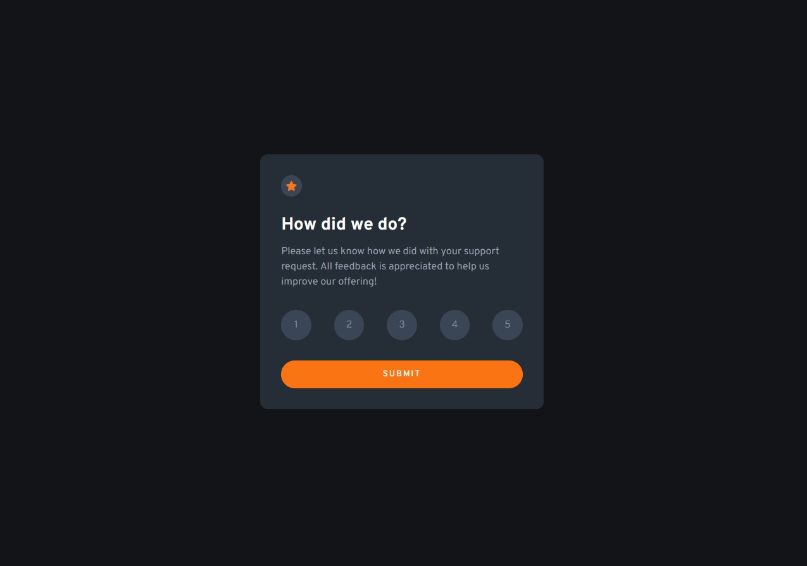
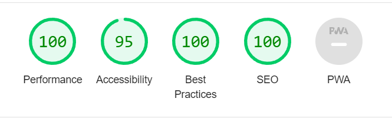

<p id="readme-top"></p>
<div align="center">
  <h3 align="center">Interactive Rating System</h3>

  <p align="center">
     Interactive Rating System based on frontend mentor design..
    <br />
    <br />
    <a href="https://interactive-rating-system-zeta.vercel.app/">View a project demo</a>
  </p>



</div>

## Lighthouse Statistics



<!-- TABLE OF CONTENTS -->
<details>
  <summary>Table of Contents</summary>
  <ol>
    <li>
      <a href="#about-the-project">About The Project</a>
      <ul>
        <li><a href="#built-with">Built With</a></li>
      </ul>
    </li>
    <li>
      <a href="#getting-started">Getting Started</a>
      <ul>
        <li><a href="#installation">Installation</a></li>
      </ul>
    </li>
  </ol>
</details>

<!-- ABOUT THE PROJECT -->

## About The Project

Rate in your own way how our support helped you.

<p align="right">(<a href="#readme-top">back to top</a>)</p>

### Built With

Technologies used:

- 
- 
- 
- 
- 

<p align="right">(<a href="#readme-top">back to top</a>)</p>

<!-- GETTING STARTED -->

## Getting Started

- Install

```sh
  npm install
```

- Run a server

```sh
  npm run dev
```

- Run a tests

```sh
  npm run test
```

<p align="right">(<a href="#readme-top">back to top</a>)</p>
